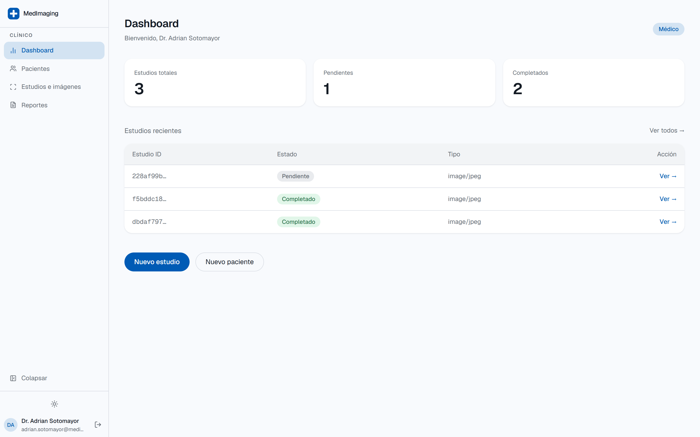
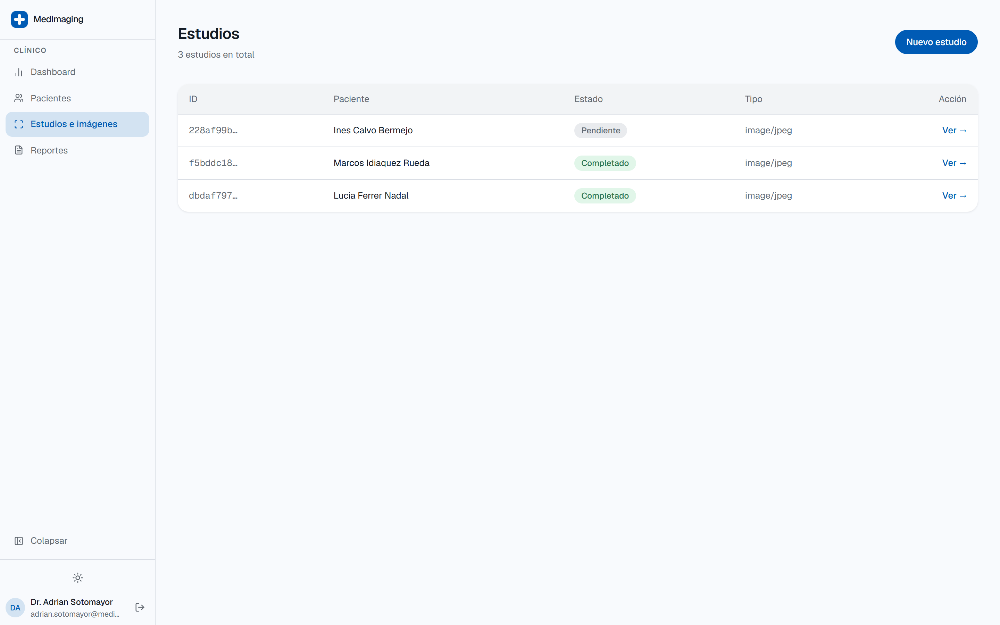
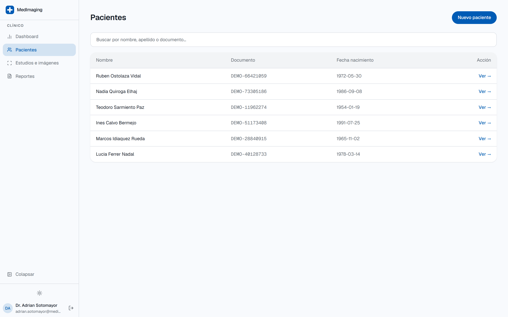
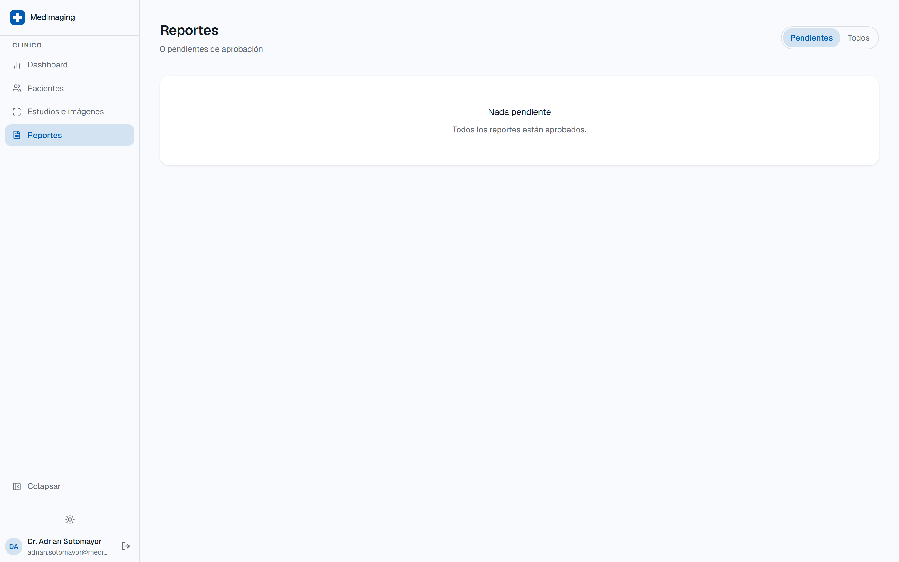
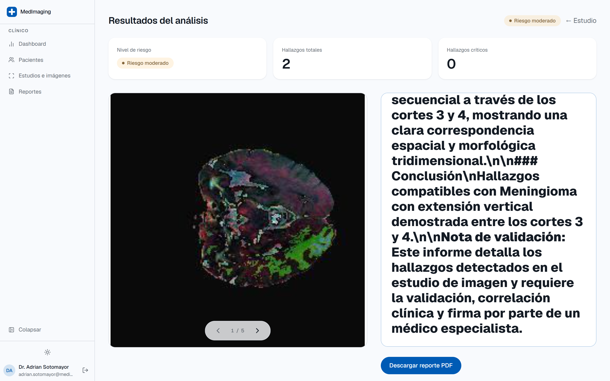
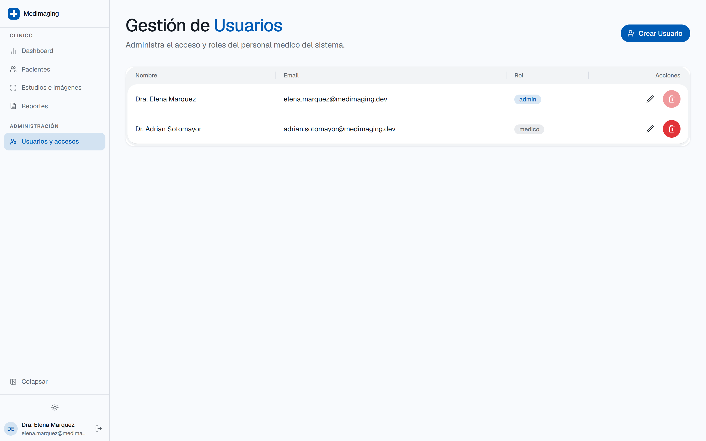
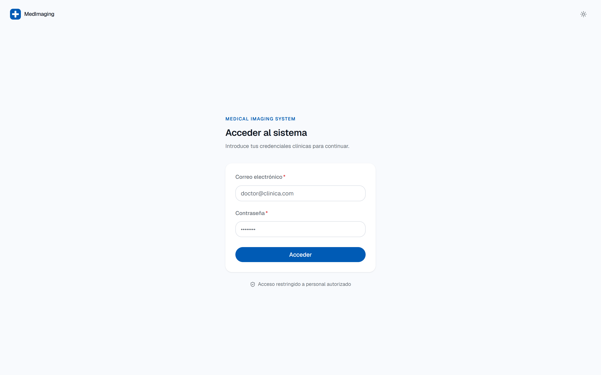
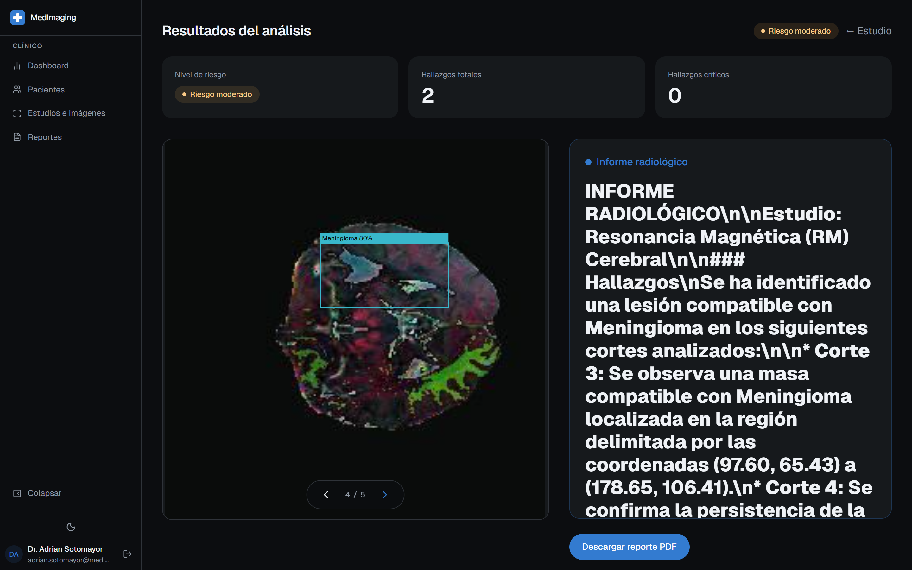
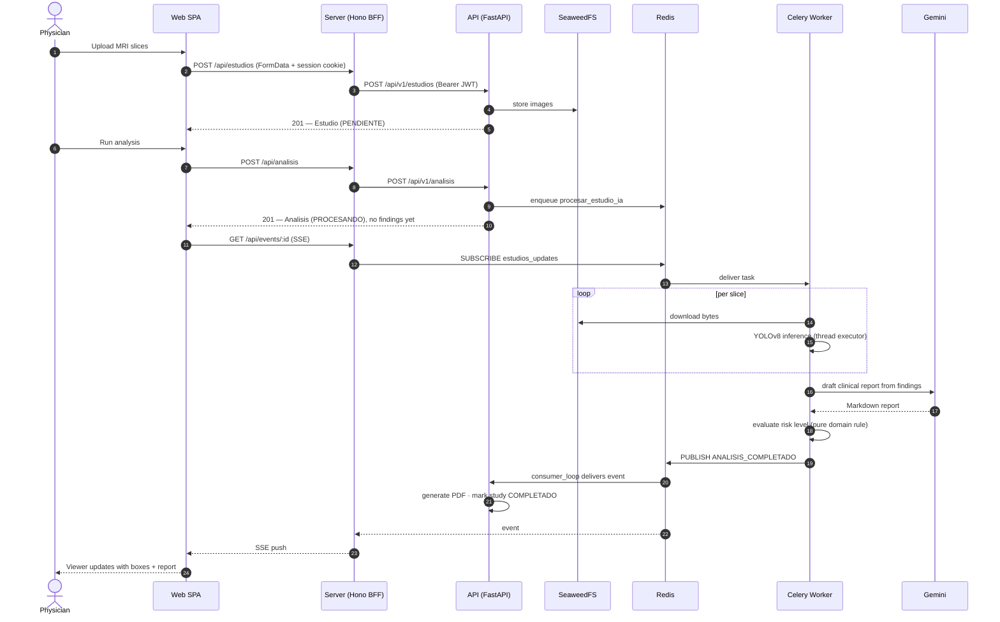
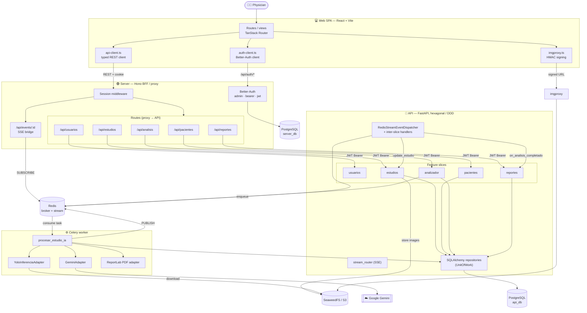

<div align="center">

# MedImaging — AI-Assisted MRI Triage Platform

**Upload an MRI study → a YOLO model detects findings → an LLM drafts the radiology report → the physician reviews, edits, approves and exports a signed PDF.**

A full-stack, production-shaped medical imaging workspace: a React SPA, a Hono BFF, and a FastAPI backend built on vertical-slice DDD with a Celery worker doing the CPU-bound AI inference off the request path.

<br />


</div>

---

## What this is

Radiologists reading MRI studies spend a large share of their time on two things a
computer is good at: **spotting candidate findings** and **writing them up**.
MedImaging automates both, then puts a physician in front of the result before
anything becomes official.

A clinician registers a patient, uploads the slices of an MRI study, and hits
*analyse*. The request returns immediately — the heavy work is handed to a
background worker that runs a YOLOv8 detector over every slice, scores the
study's risk level from pure domain rules, asks an LLM to draft a structured
radiology report from the raw detections, and renders a PDF. The browser is
notified over Server-Sent Events the moment it's done.

The physician then reviews the detections drawn over the original scan, edits
the report, and **approves** it — at which point the report becomes immutable
and records who signed it and when.

> [!IMPORTANT]
> This is a portfolio/engineering project. It is **not** a certified medical
> device and must not be used for real diagnosis. Every generated report is
> explicitly marked as requiring physician validation.

---

## Screenshots

All screenshots are of the running stack with live YOLOv8 inference and a live
LLM report — no mockups. Demo data uses the CC BY 4.0
[Roboflow 100 `brain-tumor-m2pbp`](https://universe.roboflow.com/roboflow-100/brain-tumor-m2pbp)
dataset (the one the bundled model was trained on) and fictional patient
records. Details in the [screenshot notes](docs/screenshots/README.md).

### The AI viewer — detections drawn over the original study

The core of the product. The `Meningioma 80%` box is a real detection from the
bundled model, rescaled from the source scan geometry onto the imgproxy-resized
image the viewer serves. Risk level and finding counts are computed from the
detections; the report on the right was drafted by the LLM.


### Dashboard and study triage

<table>
<tr>
<td width="50%"></td>
<td width="50%"></td>
</tr>
<tr>
<td align="center"><em>Dashboard — study counters at a glance</em></td>
<td align="center"><em>Studies — status colour-coded per state</em></td>
</tr>
<tr>
<td width="50%"></td>
<td width="50%"></td>
</tr>
<tr>
<td align="center"><em>Patients</em></td>
<td align="center"><em>Reports — pending until a physician approves</em></td>
</tr>
</table>

### The generated report, and role-based access

<table>
<tr>
<td width="50%"></td>
<td width="50%"></td>
</tr>
<tr>
<td align="center"><em>Report conclusion — note the vertical extension across slices 3–4 and the physician-validation notice the prompt enforces</em></td>
<td align="center"><em>Admin-only user management</em></td>
</tr>
</table>

### Light and dark, both first-class

<table>
<tr>
<td width="50%"></td>
<td width="50%"></td>
</tr>
</table>

---

## Features

| | |
| --- | --- |
| 🧠 **YOLOv8 detection** | Runs over every slice of a study. Reads native **DICOM** (`pydicom`, with 12/16-bit → 8-bit normalisation) and falls back to PNG/JPEG. Only detections at **≥ 0.80 confidence** are ever recorded. |
| 📊 **Deterministic risk scoring** | Risk (`BAJO` / `MODERADO` / `CRITICO`) is computed by a pure domain rule, not by the model — auditable, unit-testable, and independent of the AI vendor. |
| ✍️ **LLM-drafted radiology report** | Google Gemini turns the raw detection table into a structured Markdown report, including vertical extension across sequential slices. The prompt forbids mentioning AI, models or vendors — the report reads as the physician's own. |
| 👁️ **Bounding-box viewer** | Boxes are stored with the *original* image dimensions so the front-end can rescale them correctly onto the imgproxy-resized image, accounting for letterboxing from `object-contain`. |
| ⚡ **Non-blocking pipeline** | Inference, PDF rendering and image processing run in a Celery worker; inside the API, every CPU-bound call is isolated with `run_in_executor` so the asyncio event loop never stalls. |
| 🔔 **Real-time updates (SSE)** | The worker publishes to a Redis stream; the BFF bridges it to the browser over Server-Sent Events, so the study list updates without polling. |
| 📄 **Immutable approved reports** | A report is editable in `GENERANDO` / `LISTO` / `FALLIDO`. Approving it freezes it permanently and stamps the approving physician's ID and timestamp. |
| 🔐 **Session + JWT auth** | Better-Auth holds the browser session (httpOnly cookie); the BFF mints a short-lived JWT per request to call the Python API. The API is never exposed to the browser. |
| 🗄️ **S3-compatible storage** | Studies are stored in SeaweedFS; the browser only ever receives **HMAC-signed imgproxy URLs**, never a direct object path. |
| 🎨 **Purpose-driven design system** | An OKLCH palette where every saturated colour maps to a clinical meaning. Full spec in [DESIGN.md](DESIGN.md). |

---

## How a study flows through the system



### The risk rule, in full

Risk is **not** whatever the model says. It is derived in
[`AnalisisResonancia._evaluar_severidad_riesgo`](apps/api/src/features/analizador/domain/entities.py):

```
no findings                                          → BAJO
critical label AND max confidence > 0.85             → CRITICO
critical label OR ≥ 3 findings OR max conf > 0.70    → MODERADO
otherwise                                            → BAJO
```

where a *critical label* is `tumor`, `hemorragia` or `isquemia`. Detections
below 0.80 confidence never reach this function at all — the threshold is
applied twice on purpose (as YOLO's `conf` argument *and* as an explicit filter)
so the invariant survives an Ultralytics upgrade.

### Lifecycle states

| Entity | States |
| --- | --- |
| **Estudio** | `PENDIENTE` → `EN_ANALISIS` → `COMPLETADO` \| `FALLIDO` |
| **Análisis** | `PENDIENTE` → `PROCESANDO` → `COMPLETADO` \| `FALLIDO` |
| **Reporte** | `GENERANDO` → `LISTO` \| `FALLIDO` → **`APROBADO`** *(terminal, immutable)* |

---

## Architecture

Three deployable apps, one shared monorepo. The browser talks **only** to the
Hono BFF; the Python API, the database, Redis and object storage are never
reachable from the internet.



More diagrams (deployment, classes, use cases, communication) live in
[`docs/diagramas/`](docs/diagramas/).

### Why a BFF in front of the Python API?

The browser holds a Better-Auth **session cookie**; the Python API validates
**JWTs**. The Hono layer is where those two worlds meet: it resolves the
session, mints a scoped JWT, and forwards the call. That keeps FastAPI free of
cookie/CSRF concerns, keeps the API off the public network, and gives the SPA a
single same-origin surface — which is also what makes the SSE bridge possible.

### Why a separate worker?

YOLO inference is CPU/GPU-bound and can take tens of seconds across a multi-slice
study. Running it in-process would block FastAPI's event loop and hold an HTTP
connection open. Instead the API enqueues to Celery and returns `201` in
milliseconds; the worker publishes `ANALISIS_COMPLETADO` to a Redis stream when
finished, and two decoupled handlers react to it — one generates the PDF report,
one flips the study to `COMPLETADO`.

There's a deliberate belt-and-braces detail here: the worker *also* updates the
study status directly, in its own transaction. Redis Streams won't redeliver an
already-delivered-but-unacked message, so if the consumer loop were the only
path, a handler failure would strand a study in `EN_ANALISIS` forever. The
direct call is the source of truth; the event drives the *other* effects.

---

## Tech stack

<table>
<tr><th align="left">Layer</th><th align="left">Choices</th></tr>
<tr>
<td><b>Frontend</b><br /><code>apps/web</code></td>
<td>React · TypeScript · <b>Vite 8</b> · <b>TanStack Router</b> (file-based, fully typed) · TanStack Query · TanStack Form · <b>HeroUI v3</b> (React Aria) · Tailwind CSS v4 · <code>next-themes</code> · <code>@react-pdf/renderer</code> · <code>react-markdown</code> · Sonner</td>
</tr>
<tr>
<td><b>BFF</b><br /><code>apps/server</code></td>
<td><b>Hono</b> on Node · <b>Better-Auth</b> (<code>admin</code> + <code>bearer</code> + <code>jwt</code> plugins) · <b>Drizzle ORM</b> · PostgreSQL · ioredis · Zod</td>
</tr>
<tr>
<td><b>API</b><br /><code>apps/api</code></td>
<td><b>Python 3.14</b> (uv) · <b>FastAPI</b> · <b>Hexcore</b> (vertical-slice + DDD framework) · SQLAlchemy 2.0 async (asyncpg) · Alembic · Pydantic · pytest</td>
</tr>
<tr>
<td><b>AI / worker</b></td>
<td><b>Celery</b> + Redis · <b>Ultralytics YOLOv8</b> · PyTorch · OpenCV · <b>pydicom</b> · <b>Google Gemini</b> · ReportLab</td>
</tr>
<tr>
<td><b>Infrastructure</b></td>
<td>Docker Compose · PostgreSQL 18 · Redis · <b>SeaweedFS</b> (S3-compatible) · <b>imgproxy</b> (signed image transforms) · nginx · Dokploy</td>
</tr>
<tr>
<td><b>Tooling</b></td>
<td><b>Turborepo</b> · pnpm workspaces · shared TypeScript project references · ruff (Python)</td>
</tr>
</table>

---

## Repository structure

```
medical-system/
├── apps/
│   ├── web/          # React SPA — TanStack Router, HeroUI v3
│   ├── server/       # Hono BFF — Better-Auth, session→JWT, SSE bridge
│   └── api/          # FastAPI — DDD slices, YOLO, Gemini, Celery worker
├── packages/
│   ├── ui/           # Shared shadcn/ui primitives + design tokens
│   ├── auth/         # Better-Auth configuration
│   ├── db/           # Drizzle schema + migrations (auth database)
│   ├── env/          # Zod-validated environment variables
│   └── config/       # Shared TypeScript base configuration
├── docs/
│   ├── diagramas/    # Mermaid: deployment, classes, components, sequence, use cases
│   └── screenshots/  # UI screenshots (see capture guide)
├── DESIGN.md         # Design system: OKLCH palette, type scale, component rules
├── PRODUCT.md        # Product brief: users, purpose, brand personality
└── docker-compose.yml
```

The Python API is documented in depth in **[`apps/api/README.md`](apps/api/README.md)** —
architecture rules, slice layout, testing strategy and contribution guidelines.

---

## Running it

### Option A — Docker Compose (full stack, recommended)

Brings up everything: both PostgreSQL databases, Redis, SeaweedFS, imgproxy,
the API, the Celery worker, the BFF and the nginx-served SPA.

```bash
cp .env.example .env      # fill POSTGRES_*, BETTER_AUTH_SECRET, GEMINI_API_KEY, IMGPROXY_*
docker compose up -d
```

| Service | URL |
| --- | --- |
| Web app | http://localhost:8080 |
| BFF | http://localhost:3000 |
| API (Swagger UI) | http://localhost:8000/docs |
| SeaweedFS S3 | http://localhost:8333 |
| imgproxy | http://localhost:8082 |

**First run:** open the web app and complete the setup screen at `/setup` to
create the initial administrator (creation key `MEDICAL-ADMIN-USER-CREATION`).
Once one user exists, `/check-setup` reports the system as provisioned and the
setup route stops accepting new admins.

Real inference needs the YOLO weights at `apps/api/models/yolo_resonancia.pt`
and a valid `GEMINI_API_KEY`. Without them the upload/patient/report flows still
work — only the analysis step fails.

### Option B — Local development

```bash
pnpm install                 # JS workspace
pnpm run db:push             # push the Drizzle auth schema to PostgreSQL

cd apps/api && uv sync --python 3.14   # Python API

# Terminal 1 — API
cd apps/api && fastapi dev main.py

# Terminal 2 — Celery worker
cd apps/api && uv run celery -A src.worker worker --loglevel=info -c 1

# Terminal 3 — web + BFF
pnpm run dev
```

| App | Dev URL |
| --- | --- |
| Web (Vite) | http://localhost:3001 |
| BFF (Hono) | http://localhost:3000 |
| API (FastAPI) | http://localhost:8000 |

Redis and a PostgreSQL instance still need to be reachable — the quickest path
is `docker compose up -d medical-postgres medical-redis medical-seaweedfs`.

### Scripts

| Command | Does |
| --- | --- |
| `pnpm run dev` | Start web + BFF via Turborepo |
| `pnpm run dev:web` / `dev:server` | Start one app only |
| `pnpm run build` | Build all JS apps |
| `pnpm run check-types` | Type-check the whole workspace |
| `pnpm run db:push` / `db:generate` / `db:migrate` / `db:studio` | Drizzle schema workflow |
| `uv run pytest -v tests/` *(in `apps/api`)* | API test suite, AI mocked |
| `uv run pytest -m ia -v` *(in `apps/api`)* | Run the real PyTorch/YOLO tests |

---

## API surface

Everything the browser calls goes through the BFF at `/api/*`, which proxies to
the FastAPI service under `/api/v1/*`.

| Method | BFF route | Purpose |
| --- | --- | --- |
| `POST` | `/api/auth/*` | Better-Auth (sign-in, sign-up, session) |
| `GET` | `/check-setup` | Whether a first admin still needs creating |
| `POST` | `/create-admin` | One-time bootstrap of the initial administrator |
| `GET` `POST` | `/api/pacientes` | List / create patients |
| `GET` | `/api/pacientes/:id` | Patient detail |
| `GET` `POST` | `/api/estudios` | List / create studies |
| `POST` | `/api/estudios/imagenes` | Multipart upload of study slices |
| `GET` | `/api/estudios/:id` | Study detail |
| `POST` | `/api/analisis` | Enqueue AI analysis for a study |
| `GET` | `/api/analisis/:estudio_id` | Findings, risk level and drafted report |
| `GET` | `/api/reportes` | List reports |
| `GET` `PATCH` | `/api/reportes/:estudio_id` | Read / edit a pending report |
| `POST` | `/api/reportes/:estudio_id/aprobar` | Approve — freezes the report |
| `GET` | `/api/reportes/:estudio_id/descargar` | Download the PDF |
| `GET` | `/api/events/:id` | SSE stream of study updates |
| `GET` | `/api/usuarios/me` | Current user profile |

Interactive OpenAPI docs for the Python service: `http://localhost:8000/docs`.

---

## Engineering notes worth reading the code for

- **Vertical-slice DDD, enforced.** Each feature owns its `domain/`,
  `application/` and `infrastructure/` folders. ORM models may never be imported
  into `domain/` or `application/` — coupling only ever points inward. See the
  architecture rules at the end of [`apps/api/README.md`](apps/api/README.md).
- **Domain events across slices.** `analizador` emits `AnalisisCompletadoEvent`;
  `reportes` and `estudios` subscribe. Neither slice imports the other — the
  Redis-backed dispatcher is the only link, and each handler runs in its own
  Unit of Work.
- **Bounding-box coordinate transforms.** Findings persist `img_width` /
  `img_height` from the *source* image so the viewer can map YOLO's `xyxy`
  coordinates onto an imgproxy-resized ``, correcting for the letterbox
  offset introduced by `object-contain`.
- **DICOM handling.** `pydicom` reads the pixel array, normalises 12/16-bit
  depth down to 8-bit and converts greyscale to BGR before YOLO sees it — with a
  clean fallback to `cv2.imdecode` for ordinary PNG/JPEG uploads.
- **Prompt discipline.** The report prompt runs at `temperature=0.2` with a
  JSON response schema and explicitly forbids the model from referencing AI,
  neural networks, vendors or itself — a generated report that mentions its own
  provenance is a clinical-trust failure, not a cosmetic one.
- **Layered tests.** Unit tests for domain rules (no I/O, millisecond runtime),
  integration tests for the hybrid JSON-column persistence, and E2E tests
  driving the full HTTP flow with the heavy ports mocked. The real-model tests
  are quarantined behind the `ia` marker so CI stays fast.
- **Design system as a contract.** [DESIGN.md](DESIGN.md) specifies an OKLCH-only
  palette with named rules — the *Meaning-Only Rule* (green/amber/red/cyan
  encode risk and status, never decoration), the *Soft-Fill Rule* (badges use
  tinted fills so several states coexist in one table row) and the *One Shadow
  Rule* (a surface gets a border **or** a shadow, never both).

---

## Roles

| Role | Can |
| --- | --- |
| `medico` *(default)* | Register patients, upload studies, run analyses, review and approve reports, download PDFs |
| `admin` | Everything above, plus user management (create, edit, delete accounts) |

---

## License

Released under the [MIT License](LICENSE) — free to use, modify and distribute,
including commercially, provided the copyright notice is retained.

The permissive license covers the **software**. It is not a clearance for
clinical use: as stated above, this is not a certified medical device, it
carries no warranty of any kind, and deploying it in a real diagnostic setting
would be your responsibility, including any regulatory approval (FDA, CE/MDR,
or your local equivalent) and patient-data obligations (HIPAA, GDPR).
