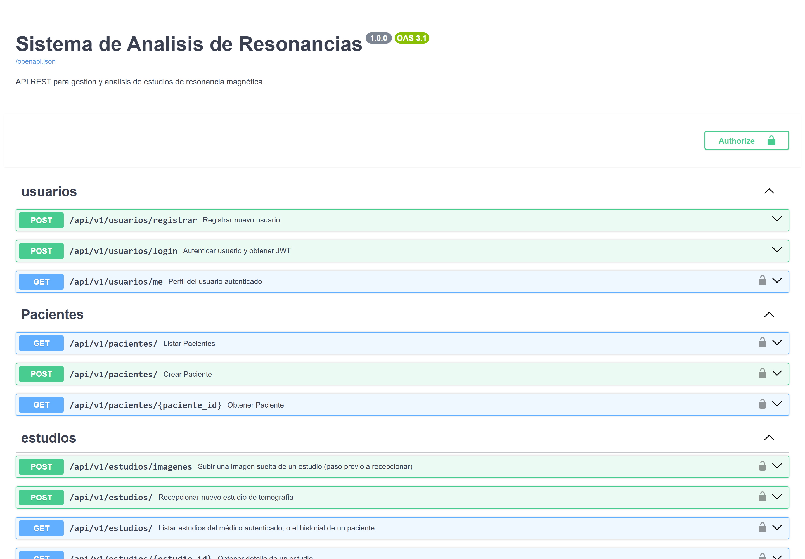
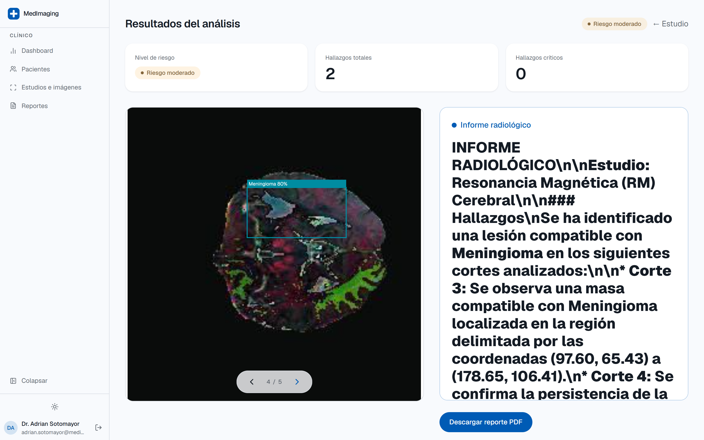
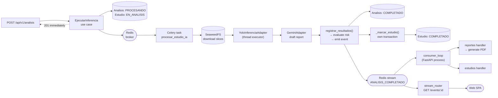

<div align="center">

# MedImaging API — FastAPI Backend

**The analysis engine behind [MedImaging](../../README.md):** MRI study ingestion, YOLOv8 detection, deterministic risk scoring, LLM-drafted radiology reports and PDF generation — built as vertical slices over a hexagonal/DDD core.


</div>

---

## What this service does

It is the only component that touches the clinical data. Given the slices of an
MRI study it will:

1. **Ingest** them asynchronously (`aiofiles` / `aioboto3`) into S3-compatible storage.
2. **Detect** findings on every slice with a YOLOv8 model — reading native
   **DICOM** or ordinary PNG/JPEG.
3. **Score risk** (`BAJO` / `MODERADO` / `CRITICO`) with a pure domain rule that
   has no dependency on the model or its vendor.
4. **Draft a radiology report** in Markdown from the raw detection table, via an LLM.
5. **Render a PDF** and expose it for download.
6. **Publish** `AnalisisCompletadoEvent` so other slices — and the SPA, over SSE — react.

Steps 2–5 run in a **Celery worker**, never on the request path.

> [!NOTE]
> This service is not exposed publicly. It sits behind the Hono BFF
> ([`apps/server`](../server)), which resolves the browser session and forwards
> each call with a short-lived JWT. See the [root README](../../README.md#why-a-bff-in-front-of-the-python-api)
> for why.

---

## Screenshots

The API has no UI of its own, but two views are worth seeing — the interactive
OpenAPI documentation it generates, and the front-end screen it ultimately powers.

<table>
<tr>
<td width="50%"></td>
<td width="50%"></td>
</tr>
<tr>
<td align="center"><em>Auto-generated OpenAPI docs at <code>/docs</code></em></td>
<td align="center"><em>What the findings look like once the SPA renders them</em></td>
</tr>
</table>

> Screenshot files live in [`docs/screenshots/`](../../docs/screenshots/) —
> see the [capture guide](../../docs/screenshots/README.md). `11-swagger.png` is
> the easiest one to produce: run the service and screenshot `http://localhost:8000/docs`
> with the five routers expanded.

---

## Architecture

The service is built on **Vertical-Slice Architecture** with **Domain-Driven
Design**, using the **Hexcore** framework. Code is organised strictly by
business capability, not by technical layer — each slice owns its full stack and
keeps persistence and external infrastructure at arm's length from pure business
logic.

```
src/
├── features/
│   ├── usuarios/       # Identity, staff registration, JWT authentication
│   ├── pacientes/      # Patient records
│   ├── estudios/       # Study ingestion, multipart upload, S3 storage
│   ├── analizador/     # ⭐ Inference core: YOLO, risk rules, LLM report
│   └── reportes/       # PDF generation, physician review & approval
├── shared/
│   ├── infrastructure/ # DB engine, Redis client, event dispatcher, SSE router
│   └── ...
└── worker.py           # Celery application
```

Every slice follows the same three-layer shape:

| Layer | Holds | May import |
| --- | --- | --- |
| `domain/` | Entities, value objects, domain services, events, ports (protocols), exceptions | Nothing outside the domain |
| `application/` | Use cases, DTOs, event handlers, Celery tasks | `domain/` |
| `infrastructure/` | SQLAlchemy models, repositories, adapters, FastAPI routers | `domain/` + `application/` |

**Dependencies point inward, always.** An ORM model never appears in `domain/`
or `application/`.

### The slices

#### `usuarios`
Identity and authentication. Issues and validates JWTs; the token issuer and
audience must match Better-Auth's `BETTER_AUTH_URL`, since the BFF is what mints
them. `PyJWT[crypto]` is used so EdDSA/RS256/ES256 via JWKS are supported.

#### `pacientes`
Patient records. Modelled as a first-class slice, but also embedded as a
**Value Object** inside `Estudio` — persisted transparently as a JSON column via
Hexcore's `fields_resolvers` / `fields_serializers`, so the entity stays free of
serialisation logic.

#### `estudios`
Non-blocking multipart ingestion of study slices into SeaweedFS. Emits
`EstudioRecibidoEvent` on successful persistence.

Lifecycle: `PENDIENTE` → `EN_ANALISIS` → `COMPLETADO` | `FALLIDO`

#### `analizador` ⭐
The inference core, and the most interesting part of the codebase.

- **`YoloInferenciaAdapter`** wraps Ultralytics YOLOv8. Model loading is lazy
  (so startup isn't blocked) and inference is dispatched to a thread executor
  (so the asyncio loop isn't blocked). It first attempts `pydicom.dcmread`,
  normalising 12/16-bit pixel arrays down to 8-bit and converting greyscale to
  BGR; on `InvalidDicomError` it falls back to `cv2.imdecode` for PNG/JPEG.
- **Confidence floor of 0.80**, applied *twice on purpose* — as YOLO's `conf`
  argument (so low-confidence objects are never even constructed) and again as
  an explicit filter (so the invariant survives an Ultralytics behaviour change).
  Anything below it never reaches the viewer, the findings table, or the risk
  calculation.
- **`GeminiAdapter`** turns the raw detection table into a structured Markdown
  report. `temperature=0.2`, a JSON response schema, and a prompt that forbids
  mentioning AI, neural networks, algorithms or vendors — the report has to read
  as something a radiologist would sign. On failure it substitutes a fixed
  message that names no provider and tells the physician to write the report
  themselves.
- **`Hallazgo`** (finding) is a frozen value object carrying the label,
  confidence, bounding box, slice index, **and the source image's pixel
  dimensions** — without the latter the front-end cannot rescale boxes onto the
  imgproxy-resized image it actually displays.

The risk rule lives in `AnalisisResonancia._evaluar_severidad_riesgo` and is
pure — no I/O, no framework, trivially unit-testable:

```python
no findings                                        → BAJO
critical label AND max confidence > 0.85           → CRITICO
critical label OR ≥ 3 findings OR max conf > 0.70  → MODERADO
otherwise                                          → BAJO
```

Critical labels: `tumor`, `hemorragia`, `isquemia`.

Lifecycle: `PENDIENTE` → `PROCESANDO` → `COMPLETADO` | `FALLIDO`

#### `reportes`
Reacts to `AnalisisCompletadoEvent` in its **own independent Unit of Work**,
orchestrating PDF generation with ReportLab.

Lifecycle: `GENERANDO` → `LISTO` | `FALLIDO` → **`APROBADO`**

`APROBADO` is terminal and immutable: `Reporte.editar()` raises
`ReporteNoEditableException` once approved, and approval stamps the physician's
Better-Auth ID and a UTC timestamp for traceability. A physician can complement
`observaciones` and correct `nivel_riesgo` any time before that.

---

## Async pipeline & event flow



### Why the study status is written twice

The worker marks the study `COMPLETADO` **directly**, in its own transaction,
*and* the event triggers a handler that does the same thing. That's deliberate,
not an oversight.

Redis Streams will not redeliver a message that was delivered but never
acknowledged. If the event pipeline were the only path and its handler failed —
or the consumer loop wasn't running — the study would sit in `EN_ANALISIS`
forever with no retry. So the direct call is the source of truth for status; the
event exists to drive the *other* effects (PDF generation, SSE notification).

Failures are handled symmetrically: if inference raises, the task marks the
study `FALLIDO` in a separate transaction before re-raising, so a crash can
never strand the record.

---

## Tech stack

| Concern | Choice |
| --- | --- |
| Language | Python 3.14, managed with [`uv`](https://github.com/astral-sh/uv) |
| Web framework | FastAPI (`fastapi[standard]`) |
| Architecture framework | Hexcore ≥ 2.0.6 |
| ORM | SQLAlchemy 2.0 (`Mapped` columns, JSON field resolvers) |
| Database | PostgreSQL via `asyncpg` (prod) · SQLite via `aiosqlite` (dev/tests) |
| Migrations | Alembic |
| Task queue | Celery 5.6 + Redis |
| Events | `RedisStreamEventDispatcher` (Redis Streams) |
| Object storage | `aioboto3` → SeaweedFS (S3-compatible) |
| Detection | Ultralytics YOLOv8 · OpenCV (headless) · pydicom |
| Report drafting | `google-genai` (Gemini) |
| PDF | ReportLab |
| Auth | `PyJWT[crypto]` — JWKS, EdDSA/RS256/ES256 |
| Tests | pytest · pytest-asyncio · httpx · pytest-cov |
| Lint | ruff (`E`, `F`, `I`, `UP`, line length 100) |

The database URL is written **once** as `DATABASE_URL`; `config.py` derives both
the sync (`psycopg2`, for Alembic) and async (`asyncpg`) variants from it,
normalising whatever driver the base URL happens to carry. Setting
`ENVIRONMENT=production` without a `DATABASE_URL` raises at import time rather
than silently falling back to SQLite.

---

## Getting started

### Install

```bash
cd apps/api
uv sync --python 3.14
```

### AI model weights

Place the YOLO weights at the path set by `yolo_model_path` in
[`config.py`](config.py) — `models/yolo_resonancia.pt` by default. Without them
the test suite falls back to mocks and the analysis endpoint fails at inference
time; patients, studies and reports still work.

### Run

```bash
# Development server with hot reload
fastapi dev main.py

# Celery worker (separate terminal — the AI never runs in the API process)
uv run celery -A src.worker worker --loglevel=info -c 1
```

Interactive OpenAPI docs: **http://127.0.0.1:8000/docs**
Health check (used by the Docker healthcheck): `GET /health`

In debug mode (`ENVIRONMENT` ≠ `production`) tables are created automatically on
startup. In production, run migrations instead:

```bash
uv run alembic upgrade head
```

---

## Endpoints

All routers are mounted under the `/api/v1` prefix.

### `usuarios`
| Method | Path | Purpose |
| --- | --- | --- |
| `POST` | `/api/v1/usuarios/registrar` | Register medical staff |
| `POST` | `/api/v1/usuarios/login` | Authenticate, receive JWT |
| `GET` | `/api/v1/usuarios/me` | Current user profile |

### `pacientes`
| Method | Path | Purpose |
| --- | --- | --- |
| `POST` | `/api/v1/pacientes/` | Create patient |
| `GET` | `/api/v1/pacientes/` | List patients |
| `GET` | `/api/v1/pacientes/{paciente_id}` | Patient detail |

### `estudios`
| Method | Path | Purpose |
| --- | --- | --- |
| `POST` | `/api/v1/estudios/imagenes` | Multipart upload of study slices |
| `POST` | `/api/v1/estudios/` | Register the study against a patient |
| `GET` | `/api/v1/estudios/` | List studies |
| `GET` | `/api/v1/estudios/{estudio_id}` | Study detail |

### `analizador`
| Method | Path | Purpose |
| --- | --- | --- |
| `POST` | `/api/v1/analisis/` | Enqueue inference — returns `201` immediately |
| `GET` | `/api/v1/analisis/{estudio_id}` | Findings, risk level, drafted report |

### `reportes`
| Method | Path | Purpose |
| --- | --- | --- |
| `GET` | `/api/v1/reportes/` | List reports |
| `GET` | `/api/v1/reportes/{estudio_id}` | Report detail |
| `PATCH` | `/api/v1/reportes/{estudio_id}` | Edit observations / risk — pending reports only |
| `POST` | `/api/v1/reportes/{estudio_id}/aprobar` | Approve — freezes the report permanently |
| `GET` | `/api/v1/reportes/{estudio_id}/descargar` | Download the PDF |

### Realtime
| Method | Path | Purpose |
| --- | --- | --- |
| `GET` | `/api/v1/events/{estudio_id}` | Server-Sent Events stream for a study |

---

## Testing

A layered suite, isolated by a physical temporary SQLite database per session.

| Layer | Location | Covers |
| --- | --- | --- |
| **Unit** | `tests/unit/` | Domain rules and value objects. No database, no I/O — runs in milliseconds. |
| **Integration** | `tests/integration/` | Hybrid persistence: nested objects mapped into JSON columns, UUID serialisation, repository round-trips. |
| **E2E** | `tests/e2e/` | Full HTTP flows — register → multipart upload → (mocked) inference → report state. |

CPU-heavy (YOLO) and I/O-heavy (storage, PDF) ports are mocked by default using
native `ProjectConfig` subclasses rather than `dependency_overrides`.

```bash
# Fast suite — AI mocked
uv run pytest -v tests/

# With coverage
uv run pytest --cov=src tests/

# Real PyTorch/YOLO integration — slow, downloads/loads weights
uv run pytest -m ia -v
```

The `ia` marker keeps the heavy model tests out of CI while still allowing a
real tensor-consistency check against local hardware or a CI GPU on demand.

---

## Configuration

Configuration lives in [`config.py`](config.py) as a Pydantic `ProjectConfig`.
Key environment variables:

| Variable | Default | Purpose |
| --- | --- | --- |
| `DATABASE_URL` | `sqlite:///./db.sqlite3` | Base DB URL; sync/async variants derived from it |
| `ASYNC_DATABASE_URL` | *derived* | Override the async URL explicitly |
| `ENVIRONMENT` | — | `production` disables debug and requires `DATABASE_URL` |
| `CELERY_BROKER_URL` | `redis://localhost:6379/0` | Celery broker |
| `REDIS_URL` | `redis://localhost:6379/0` | Result backend + event stream |
| `GEMINI_API_KEY` | — | LLM report drafting |
| `GEMINI_MODEL` | `gemini-3.5-flash` | Model name |
| `GEMINI_PROMPT_TEMPLATE` | *(built-in radiology prompt)* | Override the report prompt |
| `S3_ENDPOINT` | `http://localhost:8333` | SeaweedFS S3 endpoint |
| `AWS_ACCESS_KEY_ID` / `AWS_SECRET_ACCESS_KEY` | `seaweed` | Object storage credentials |
| `S3_BUCKET` | `medical-system` | Bucket name |

There is also a compatibility shim at the top of `config.py`: `async_typer`
0.1.x imports a `clear` symbol removed in `typer>=0.13`, while 0.2.x changed its
constructor and breaks Hexcore's CLI. A minimal stub module is registered in
`sys.modules` before Hexcore imports, so neither version is needed.

---

## Architecture rules for contributors

1. **Never** import ORM models (`UserModel`, `AnalisisModel`, …) inside
   `domain/` or `application/`. Coupling flows exclusively from
   `infrastructure/` toward the centre.
2. Any cross-module *reaction* ("when a study is analysed, create a report")
   goes through the async `EventDispatcher` configured in `config.py`, with its
   own `UnitOfWork` — never a direct import between slices.
3. To dispatch events correctly, extract them in the **use case**, immediately
   before committing the main transaction, and publish with
   `await self.uow.events_dispatcher.dispatch(event)`. Hexcore's
   `SqlAlchemyUnitOfWork` can misbehave when `merge` and `commit` are combined
   with nested domain objects.
4. **UUIDs and foreign identifiers:** when an entity holds a foreign UUID stored
   as text (SQLite/JSON), define `fields_resolvers` and `fields_serializers` in
   the `infrastructure` repository. Use the native
   `to_entity_from_model_or_document` helper from
   `hexcore.infrastructure.repositories.utils` (it replaces the old `_to_entity`).
   Serialisation logic must never leak into the entity.
5. **Anything CPU-bound** — image compression, AI inference, dense PDF
   generation — must be isolated in infrastructure with `loop.run_in_executor()`
   so FastAPI's event loop keeps serving.
6. **The report must never reveal its own provenance.** Any change to the LLM
   prompt or its fallback text must preserve the rule that generated clinical
   text mentions no AI, model, algorithm or vendor.

---

## License

MIT — see [LICENSE](../../LICENSE) at the repository root.

---

## Related

- [Root README](../../README.md) — product overview, full stack, screenshots
- [`apps/server`](../server) — Hono BFF, Better-Auth, session → JWT bridge
- [`apps/web`](../web) — React SPA and the bounding-box viewer
- [`docs/diagramas/`](../../docs/diagramas/) — deployment, class, component, sequence and use-case diagrams
